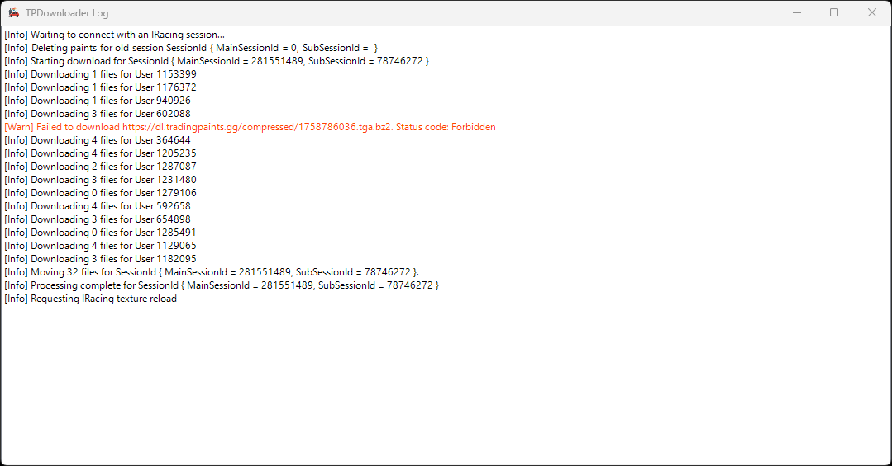

# TPDownloader

An open source alternative [Trading Paints](https://www.tradingpaints.com/) downloader for IRacing.

## Usage
1. Go to the [latest release](https://github.com/DalySoftware/TPDownloader/releases/latest).
2. Download `TPDownloader.exe` from the Assets section.
3. Place it anywhere on your computer.
4. Right-click and create a shortcut. Place it in the `shell:startup` folder to run automatically.

You're all set! TPDownloader will monitor for any IRacing session that you join and download the relevant paints.

The program starts minimized in the system tray by default. To view logs, right click the tray icon and select "Show".

## Features
- Downloads, unpacks and saves all paint types
- Triggers IRacing to refresh paints after finishing downloads
- Cleans up anything it downloaded when TPDownloader is exited or a new session is joined

No other major features are planned. The intention is to keep this program minimalist so that you can reasonably review it before running on your system.

## Disclaimer
No affiliation with Trading Paints. Provided as-is with no warranty of any kind.
